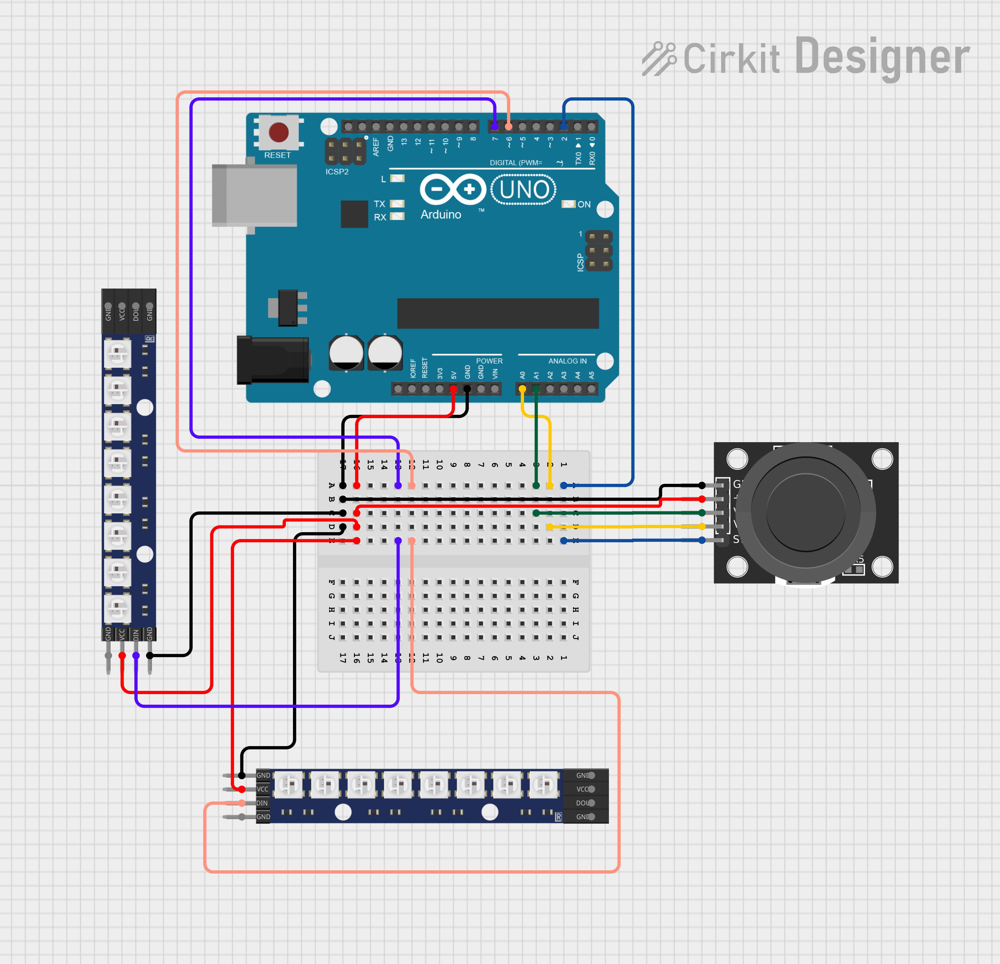

# Joystick with LEDs

## I. Informations générales

Un simple projet arduino qui indique l'orientation du joystick à l'aide de LEDs adressables
Date : 14/05/2025
Durée consacrée : 4-6h

Nouvelle connaissance : Manipuler des bits avec des opérateurs binaires en C++.

## II. Matériels

- 2 * bandeaux leds 8 leds WS2812B-8
- 1 * arduino UNO
- 1 * Joystick KY-023

## III. Schéma

## IV. Code

Voir le fichier [joysticks_with_leds.ino](joysticks_with_leds.ino)
